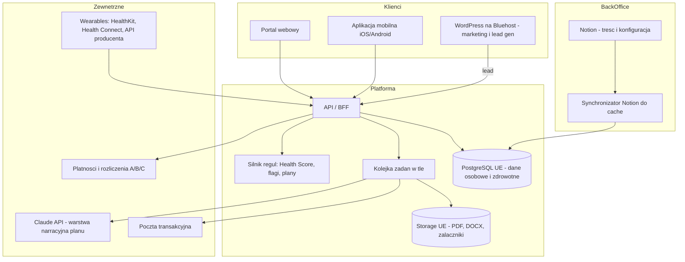
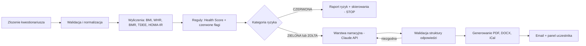

# Longevity — Specyfikacja techniczna platformy i aplikacji mobilnej

**Status:** wersja 0.2 — decyzje 2–8 rozstrzygnięte, decyzja 1 odroczona do prototypu
**Data:** 26 lipca 2026
**Autor:** przygotowane dla HCPL / FDP
**Podstawa merytoryczna:** *Longevity — Pełna macierz funkcjonalności*, *Longevity — Schemat i harmonogram realizacji*, *Longevity Platform — WordPress Integration & Medical Module*, *Model ekonomiczny v5*

---

## 0. Jak czytać ten dokument

Dokument jest specyfikacją do **zatwierdzenia przed napisaniem kodu**. Rozstrzyga: co budujemy, jak dzielimy dane, jak Notion pełni rolę back office, jak wygląda model zgód i rozliczeń, oraz co trzeba zdecydować, zanim ruszy Faza A.

**Decyzje 2–8 zostały podjęte** (rejestr w sekcji 19). Decyzja 1 — wariant hostingu produkcyjnego — jest **świadomie odroczona** do momentu zobaczenia działającego prototypu. Specyfikacja jest napisana tak, żeby ta decyzja nie wpływała na model danych ani na kontrakty API; zmienia wyłącznie warstwę wdrożeniową (sekcja 3.4).

Sekcje oznaczone **[ROZSTRZYGNIĘTE]** zawierają podjętą decyzję wraz z uzasadnieniem.
Sekcje oznaczone **[DO WALIDACJI MEDYCZNEJ]** wymagają akceptacji lekarza przed uruchomieniem produkcyjnym.

---

## 1. Zakres i cele

### 1.1 Co budujemy

Dwa produkty na jednym backendzie:

1. **Portal webowy** — dla uczestnika programu, HR, trenera, audytora, lekarza i administratora.
2. **Aplikacja mobilna** (iOS + Android) — dla uczestnika programu.

Plus **warstwa back office w Notion**, pozwalająca zespołowi HCPL/FDP rozwijać treść i konfigurację programu bez udziału programisty.

### 1.2 Cele niefunkcjonalne

| Cel | Wymaganie |
|---|---|
| Samodzielny rozwój treści | Nowa lekcja, wyzwanie, partner marketplace, zmiana cennika lub progu ZFŚS — bez deploymentu |
| Zgodność RODO | Dane art. 9 przetwarzane zgodnie z podstawą prawną, z wersjonowaną zgodą, retencją i pełnym audit logiem |
| Poza reżimem MDR | System nie stawia diagnozy i nie rekomenduje leczenia — komunikat obecny w każdym artefakcie |
| Anonimowość dashboardu HR | Brak możliwości identyfikacji osoby w danych zagregowanych (próg k-anonimowości) |
| Rozdział linii finansowych | Każda transakcja przypisana do linii A / B / C / G / M z właściwym dokumentem księgowym |
| Skala docelowa | Rok 2: ~25 zakładów, dziesiątki tysięcy użytkowników. Rok 3+: 1 mln+ (wymaga rewizji architektury — patrz 16.5) |

### 1.3 Poza zakresem

Rejestracja FDP, interpretacje KIS/ZUS, kadra trenerów, partnerzy medyczni, certyfikacja MDR IIb opaski (pozostaje po stronie polskiego producenta), bezpośrednia integracja z CeZ/COI (wieloletnia — patrz 15.13).

---

## 2. Decyzje architektoniczne

Każda decyzja z uzasadnieniem i odrzuconą alternatywą.

### ADR-01 — Notion jako CMS, nie jako baza danych

**Decyzja:** Notion pełni rolę back office dla treści i konfiguracji. Żaden rekord dotyczący zdrowia osoby fizycznej nie trafia do Notion — w żadnej formie, także zanonimizowanej.

**Uzasadnienie:**
- Notion nie ma row-level security. Każda osoba z dostępem do bazy widzi wszystkie rekordy. Przy danych art. 9 to jest naruszenie, nie niedogodność.
- Limit API ~3 żądania/sekundę. Przy 1 000 aktywnych użytkowników aplikacja czytająca z Notion w runtime przestaje działać.
- Rezydencja danych w UE dostępna wyłącznie na planie Enterprise, i tak z podprocesorami w US.
- Brak szyfrowania kolumnowego, brak audit logu na poziomie rekordu, brak kontrolowanej retencji i automatycznego usuwania.

**Odrzucona alternatywa:** Notion jako pełna baza (rozważane, bo upraszcza obsługę). Odrzucone z powyższych powodów — koszt regulacyjny nieproporcjonalny do oszczędności.

### ADR-02 — Synchronizacja Notion → aplikacja jest jednokierunkowa i buforowana

**Decyzja:** Treść i konfiguracja płyną z Notion do lokalnego cache w Postgresie (cron + webhook). Aplikacja czyta wyłącznie z cache. Nic nie wraca do Notion automatycznie.

**Uzasadnienie:** Zdejmuje zależność runtime od dostępności i limitów Notion API. Awaria Notion nie zatrzymuje platformy. Dwukierunkowa synchronizacja wprowadziłaby konflikty edycji, których nie da się rozstrzygnąć automatycznie.

**Konsekwencja:** Zmiana w Notion jest widoczna w aplikacji z opóźnieniem do 15 minut (webhook skraca to do sekund dla zmian wykrytych). Publikacja natychmiastowa dostępna przyciskiem „Synchronizuj teraz" w panelu admina.

### ADR-03 — Scoring i klasyfikacja ryzyka są deterministyczne, nie AI

**Decyzja:** Health Score, klasyfikacja ryzyka i czerwone flagi liczone są regułami zapisanymi w kodzie i wersjonowanymi. Model językowy odpowiada wyłącznie za warstwę narracyjną planu (opisy, uzasadnienia, harmonogram tygodniowy).

**Uzasadnienie:**
- Powtarzalność: ten sam zestaw odpowiedzi musi dać ten sam wynik. Model językowy tego nie gwarantuje.
- Audytowalność: przy zapytaniu pacjenta lub organu musimy pokazać, dlaczego padła kategoria ryzyka. „Model tak zdecydował" nie jest odpowiedzią.
- Bezpieczeństwo: czerwona flaga typu „glukoza > 126 mg/dl" nie może zależeć od temperatury próbkowania.
- Zgodność: art. 22 RODO (zautomatyzowane podejmowanie decyzji) jest znacznie łatwiejszy do obsłużenia przy regułach jawnych.

**Odrzucona alternatywa:** pełne generowanie planu przez model, zgodnie z dokumentem kwietniowym (Etap 3). Zachowujemy pipeline, ale przenosimy scoring i flagi przed wywołanie modelu.

### ADR-04 — Własny stack zamiast Odoo

**Decyzja:** Budujemy na Next.js + PostgreSQL + React Native. Odoo nie wchodzi jako platforma produktowa.

**Uzasadnienie:** Odoo jest dobrym ERP i słabym produktem konsumenckim. Nie daje akceptowalnego UX na mobile, gamifikacji ani wydajnego API dla aplikacji natywnej. Rozwijanie Odoo w tym kierunku kosztuje więcej niż napisanie produktu od zera.

**Kompromis:** Odoo lub wFirma mogą zostać po stronie księgowości i fakturowania, zasilane zdarzeniami z platformy przez API. To rozdziela odpowiedzialności zgodnie z ich mocnymi stronami.

*(Rozstrzyga ryzyko „Stack IT — decyzja Odoo vs własny" z dokumentu harmonogramu.)*

### ADR-05 — Jeden backend dla portalu i aplikacji mobilnej

**Decyzja:** API-first. Portal i aplikacja mobilna są dwoma klientami tego samego API.

**Uzasadnienie:** Wyklucza rozjazd logiki między web a mobile. Aplikacja mobilna z Fazy C nie wymaga przepisywania backendu — to była największa wada ścieżki WordPress z dokumentu kwietniowego.

### ADR-06 — Zmiana nazewnictwa kategorii ryzyka

**Decyzja:** Kategorie ryzyka zdrowotnego nazywamy **ZIELONA / ŻÓŁTA / CZERWONA**, nie A / B / C.

**Uzasadnienie:** Oznaczenia A/B/C są już zajęte przez linie finansowe (ryczałt ZFŚS / dopłaty indywidualne / środki obrotowe). Kolizja występuje w obecnej dokumentacji i w produkcji doprowadziłaby do błędu — np. „uczestnik kategorii C" jest dziś dwuznaczne między „wysokie ryzyko zdrowotne" a „płaci z faktury". Mapowanie historyczne: A→ZIELONA, B→ŻÓŁTA, C→CZERWONA.

---

## 3. Architektura systemu

### 3.1 Widok ogólny



### 3.2 Klasyfikacja danych — co gdzie mieszka

To jest najważniejsza tabela w dokumencie. Rozstrzyga każdy przyszły spór „czy to może pójść do Notion".

| Klasa | Przykłady | Lokalizacja | Uzasadnienie |
|---|---|---|---|
| **K1 — Zdrowotne (art. 9 RODO)** | Odpowiedzi kwestionariusza, wyniki badań, Health Score, dane z wearables, plany, dziennik objawów | **Wyłącznie Postgres UE**, szyfrowanie kolumnowe | Najwyższa kategoria ochrony |
| **K2 — Osobowe zwykłe** | Imię, e-mail, pracodawca, historia płatności | **Postgres UE** | Art. 6 RODO |
| **K3 — Pseudonimizowane** | Zdarzenia analityczne po ID uczestnika | **Postgres UE** | Nadal dane osobowe |
| **K4 — Zagregowane** | Dashboard HR (min. 10 osób w grupie) | Postgres UE, eksport do PDF | Anonimowe dopiero po spełnieniu progu |
| **K5 — Treść i konfiguracja** | Lekcje, filary, wyzwania, partnerzy, cenniki, progi ZFŚS, schemat certyfikacji | **Notion → cache** | Brak danych osobowych |
| **K6 — Operacyjne B2B** | Leady, kontakty firmowe, harmonogram warsztatów | **Notion** | Dane kontaktowe biznesowe, nie zdrowotne |

**Reguła nadrzędna:** dane K1–K4 nigdy nie opuszczają Postgresa w kierunku Notion. Egzekwowane technicznie — synchronizator ma uprawnienia wyłącznie do odczytu z Notion i zapisu do tabel cache.

### 3.3 Bluehost — rola docelowa

Bluehost pozostaje w architekturze jako **warstwa marketingowa**: strona programu, blog, materiały, formularz „Free Assessment" (Tier 1 z modelu monetyzacji — 15 pytań, bez danych z Domeny 9). Formularz przekazuje lead do API platformy przez podpisany webhook; sam nie przechowuje odpowiedzi.

To zachowuje inwestycję w istniejący hosting i jednocześnie trzyma dane zdrowotne poza nim.

### 3.4 Warianty wdrożenia produkcyjnego **[DO DECYZJI]**

Model danych i API są identyczne we wszystkich wariantach. Różnica dotyczy wyłącznie operacji.

| Wariant | Opis | Za | Przeciw |
|---|---|---|---|
| **W1 — PaaS w UE** | Aplikacja na platformie hostingowej, baza zarządzana we Frankfurcie | Najszybszy start, backupy i skalowanie w cenie | Zależność od dostawcy, koszt rośnie z ruchem |
| **W2 — VPS w PL/DE** | Wszystko na własnym serwerze (OVH PL, Hetzner) | Pełna kontrola, przewidywalny koszt, najprostszy argument compliance | Wymaga własnego DevOps: backupy, monitoring, aktualizacje |
| **W3 — Hybryda** | Front na PaaS, baza i worker na własnym VPS w PL | Kompromis kosztu i kontroli | Dwa środowiska do utrzymania |

Rekomendacja na moment decyzji: **W2** przy skali Fazy 1–2 (do ~25 zakładów), z migracją do W3 przy wejściu w B2C.

Prototyp powstaje w środowisku deweloperskim na **danych syntetycznych** — żadne dane rzeczywistych osób nie trafiają do systemu przed rozstrzygnięciem tej sekcji i przed audytem RODO (sekcja 12.6).

---

## 4. Model danych

Schemat konceptualny. Nazwy tabel w formie docelowej, typy uproszczone.

### 4.1 Tożsamość i organizacje

```
organization        id, nazwa, nip, typ (pracodawca|gmina|partner), pakiet, status
organization_unit   id, organization_id, nazwa            -- zakład / dział / lokalizacja
membership          id, user_id, organization_id, unit_id, rola, linia_finansowa, od, do
user_account        id, email, telefon, status, mfa_enabled, created_at
user_profile        user_id, imie, nazwisko, data_urodzenia, plec   -- [K2]
role_grant          user_id, rola (uczestnik|hr|trener|audytor|lekarz|admin), scope_org_id
```

Role są przypisane **w kontekście organizacji**, nie globalnie. HR firmy X nie widzi niczego z firmy Y. Egzekwowane w warstwie zapytań, nie w UI.

### 4.2 Warstwa zdrowotna [K1 — szyfrowana]

```
questionnaire            id, wersja, status, opublikowany_od
questionnaire_domain     id, questionnaire_id, numer, nazwa, kolejnosc
questionnaire_question   id, domain_id, kod, typ, tresc, walidacja_json, warunek_json
intake                   id, user_id, questionnaire_id, status, rozpoczety, zlozony
intake_answer            id, intake_id, question_id, wartosc_enc, wartosc_num
intake_derived           intake_id, bmi, whr, bmr, tdee, homa_ir, kategoria_ryzyka
lab_result               id, user_id, parametr, wartosc, jednostka, data_badania, zrodlo
lab_attachment           id, user_id, storage_key, nazwa, mime, uploaded_at
red_flag                 id, intake_id, kod, poziom, uzasadnienie, regula_wersja
health_score             id, user_id, data, wynik_ogolny, wersja_algorytmu
health_score_component   health_score_id, filar_id, wynik, wklad_json
symptom_log              id, user_id, data, sen, energia, samopoczucie, notatka_enc
```

Pola `*_enc` są szyfrowane na poziomie kolumny kluczem aplikacyjnym — dostęp do zrzutu bazy nie ujawnia treści.

`intake_answer` przechowuje równolegle `wartosc_enc` (pełna odpowiedź) i `wartosc_num` (wartość liczbowa dla pól numerycznych, potrzebna do agregacji i scoringu bez deszyfracji całości).

### 4.3 Filary — obsługa dwóch narracji

Macierz definiuje 8 filarów dla B2B i 12 dla B2G, plus 4 moduły PRIME. To ta sama treść w trzech opakowaniach, więc model musi je rozdzielić od taksonomii:

```
pillar             id, kod, nazwa, opis, ikona
pillar_scheme      id, kod (b2b_8|b2g_12|prime_4), nazwa
pillar_mapping     scheme_id, pillar_id, pozycja, nazwa_w_schemacie
```

Dzięki temu lekcja przypisana do filaru „Sen i regeneracja" pojawia się automatycznie jako filar 1 i 7 w narracji B2G oraz w module CIAŁO w PRIME — bez duplikowania treści.

**Źródło danych: Notion** (baza „Filary" + „Schematy filarów").

### 4.4 Treść i program [K5 — z Notion]

```
content_item       id, notion_id, typ (lekcja|webinar|podcast|artykul|ebook|zeszyt),
                   tytul, opis, czas_trwania, media_url, pakiety[], status, hash
content_pillar     content_item_id, pillar_id
challenge          id, notion_id, nazwa, opis, typ (indywidualne|zespolowe),
                   metryka, cel, czas_trwania_dni, punkty, pakiety[]
partner            id, notion_id, nazwa, kategoria, opis, url, prowizja_pct, status
package            id, notion_id, kod (light|pro|enterprise|prime), nazwa, cechy_json
pricing            id, package_id, wariant, cena_netto, vat, linia, obowiazuje_od
zfss_threshold      id, notion_id, prog_dochodowy, doplata_pct, obowiazuje_od
sync_log           id, zrodlo, notion_id, akcja, status, blad, ts
```

Pole `hash` pozwala synchronizatorowi wykryć realną zmianę i pominąć rekordy nietknięte.

### 4.5 Aktywność, gamifikacja, wearables

```
plan               id, user_id, intake_id, wersja, status, wygenerowany, obowiazuje_do
plan_section       plan_id, typ (zywienie|trening|sen|harmonogram|monitoring), tresc_json
plan_task          id, plan_id, dzien, pora, typ, opis, filar_id
adherence          id, user_id, plan_task_id, data, status, zrodlo
challenge_entry    id, challenge_id, user_id, team_id, postep, ukonczone_at
points_ledger      id, user_id, zrodlo, punkty, saldo_po, ts
badge              id, kod, nazwa, warunek_json
badge_award        user_id, badge_id, przyznany_at
wearable_link      id, user_id, dostawca, zakres[], zgoda_id, status, token_enc
wearable_sample    id, user_id, typ (kroki|tetno|hrv|sen|spo2|glukoza), wartosc,
                   od, do, dostawca, ingested_at
```

### 4.6 Zgody, rozliczenia, audyt

```
consent_definition id, kod, wersja, tresc, wymagana, podstawa_prawna, obowiazuje_od
consent_grant      id, user_id, consent_definition_id, udzielona_at, wycofana_at,
                   ip_hash, user_agent_hash
billing_document   id, organization_id, user_id, typ (nota_zbiorcza|nota_imienna|faktura),
                   linia, kwota_netto, vat, okres, status, numer, wystawiony
payment            id, billing_document_id, kwota, metoda, status, psp_ref, ts
audit_log          id, actor_user_id, akcja, zasob_typ, zasob_id, kontekst_json,
                   ip_hash, ts
data_request       id, user_id, typ (dostep|sprostowanie|usuniecie|przenoszenie),
                   status, zlozony, zrealizowany
```

`audit_log` jest tabelą tylko do dopisywania — brak UPDATE i DELETE na poziomie uprawnień bazy.

---

## 5. Notion jako back office — mapowanie

### 5.1 Bazy do utworzenia w Notion

| Baza Notion | Kluczowe właściwości | Kierunek | Kto edytuje |
|---|---|---|---|
| **Biblioteka treści** | Tytuł, Typ, Filary (relacja), Czas trwania, Pakiety, Link do mediów, Status, Opis | Notion → app | Akademia / komunikacja |
| **Filary** | Nazwa, Kod, Opis, Ikona, Schemat 8, Schemat 12, Moduł PRIME | Notion → app | Merytoryka |
| **Wyzwania** | Nazwa, Typ, Metryka, Cel, Czas trwania, Punkty, Pakiety, Filar | Notion → app | Program |
| **Partnerzy marketplace** | Nazwa, Kategoria, Opis, URL, Prowizja, Status umowy | Notion → app | Rozwój |
| **Pakiety i cennik** | Pakiet, Wariant, Cena netto, VAT, Linia finansowa, Obowiązuje od | Notion → app | Zarząd FDP |
| **Progi ZFŚS** | Próg dochodowy, Dopłata %, Obowiązuje od, Organizacja | Notion → app | Księgowość / HR |
| **Harmonogram warsztatów** | Temat, Data, Zakład, Trener, Status, Liczba miejsc | Notion → app | Operacje FDP |
| **Schemat certyfikacji** | Domena, Kryterium, Waga, Dowód wymagany, Wersja | Notion → app | CAC / audyt |
| **Leady B2B** | Firma, Kontakt, Etap, Pakiet, Właściciel, Następny krok | tylko Notion | Sprzedaż |

### 5.2 Mechanizm synchronizacji

1. **Cron co 10 minut** — synchronizator odpytuje każdą bazę o rekordy zmienione od ostatniego uruchomienia (`last_edited_time`).
2. **Webhook** — jeśli plan Notion na to pozwala, zdarzenie zmiany skraca opóźnienie do sekund. Cron pozostaje jako zabezpieczenie.
3. **Walidacja** — rekord niespełniający schematu (brak wymaganego pola, zły typ) nie jest importowany; trafia do `sync_log` ze statusem błędu i jest widoczny w panelu admina.
4. **Brak kaskadowego usuwania** — usunięcie strony w Notion oznacza rekord jako `status = archived`, nie kasuje go. Chroni przed przypadkową utratą treści powiązanej z historią użytkowników.
5. **Publikacja ręczna** — przycisk „Synchronizuj teraz" w panelu admina, z podglądem różnic przed zatwierdzeniem dla baz krytycznych (cennik, progi ZFŚS).

### 5.3 Limity, których trzeba przestrzegać

- Notion API: ~3 żądania/sekundę. Synchronizator ogranicza tempo i ponawia z wykładniczym opóźnieniem.
- Pełny import wszystkich baz przy starcie: rzędu kilku minut. Akceptowalne, bo dzieje się raz.
- Aplikacja **nigdy** nie wywołuje Notion API w odpowiedzi na żądanie użytkownika.

### 5.4 Brak wyjątków od jednokierunkowości **[ROZSTRZYGNIĘTE]**

**Decyzja: bez zapisu zwrotnego.** ADR-02 obowiązuje bez wyjątków — nic nie wraca do Notion automatycznie.

Rozważany był zapis liczby osób zapisanych na warsztat (nigdy nazwisk), bo operacje FDP planują w Notion. Odrzucony: obłożenie widoczne jest w panelu admina platformy, a Notion pozostaje czysto planistyczny.

**Uzasadnienie:** pierwszy wyjątek od reguły jednokierunkowości pociąga kolejne („skoro obłożenie, to czemu nie frekwencja"). Dołożenie zapisu zwrotnego po pilotażu, jeśli operacje realnie go potrzebują, jest łatwe. Usunięcie go później — nie.

W harmonogramie warsztatów kierunek synchronizacji to zatem **Notion → app**, jak we wszystkich pozostałych bazach (tabela 5.1).

---

## 6. Kontrakty API

Zarys. Pełna specyfikacja OpenAPI powstaje w Fazie A.

### 6.1 Konwencje

- REST, JSON, uwierzytelnianie tokenem, wersjonowanie ścieżką `/api/v1/`
- Każde żądanie dotyczące danych K1 zapisuje wpis w `audit_log`
- Odpowiedzi błędów w jednolitym formacie z kodem maszynowym i komunikatem po polsku
- Ograniczanie tempa: per użytkownik i per adres IP

### 6.2 Uczestnik

```
POST   /api/v1/auth/login
POST   /api/v1/auth/mfa/verify
GET    /api/v1/me
GET    /api/v1/me/consents
POST   /api/v1/me/consents/{kod}          -- udzielenie lub wycofanie
GET    /api/v1/intake/current
POST   /api/v1/intake/{id}/answers        -- zapis częściowy, krok po kroku
POST   /api/v1/intake/{id}/submit
GET    /api/v1/health-score
GET    /api/v1/health-score/history
GET    /api/v1/plan/current
GET    /api/v1/plan/{id}/documents        -- PDF, DOCX, iCal
POST   /api/v1/adherence
GET    /api/v1/challenges
POST   /api/v1/challenges/{id}/join
POST   /api/v1/symptom-log
GET    /api/v1/library                    -- z cache treści
POST   /api/v1/wearables/link
POST   /api/v1/wearables/samples          -- wsad z aplikacji mobilnej
POST   /api/v1/lab-results
GET    /api/v1/gdpr/export                -- art. 15 i 20
POST   /api/v1/gdpr/erasure               -- art. 17
```

### 6.3 HR / organizacja

```
GET    /api/v1/org/{id}/dashboard         -- wyłącznie agregaty, próg k
GET    /api/v1/org/{id}/participation
GET    /api/v1/org/{id}/workshops
GET    /api/v1/org/{id}/billing
GET    /api/v1/org/{id}/certification
```

Endpoint dashboardu **nie przyjmuje** parametru identyfikującego osobę. To ograniczenie kontraktu, nie tylko implementacji.

### 6.4 Trener, audytor, lekarz, admin

```
GET    /api/v1/trainer/sessions
POST   /api/v1/trainer/sessions/{id}/attendance
POST   /api/v1/audit/{id}/findings        -- audyt Zdrowe Biuro
GET    /api/v1/clinician/patients/{id}/card   -- Karta Pacjenta, za zgodą
POST   /api/v1/admin/sync/notion
GET    /api/v1/admin/sync/log
```

Dostęp lekarza do Karty Pacjenta wymaga aktywnej, odrębnej zgody uczestnika (`consent.share_with_clinician`) i jest logowany.

---

## 7. Silnik Health Score **[DO WALIDACJI MEDYCZNEJ]**

### 7.1 Struktura

Wynik ogólny 0–100, składany z ocen cząstkowych per filar. Każda ocena cząstkowa liczona z jawnego zestawu reguł nad odpowiedziami kwestionariusza, wynikami badań i danymi z wearables.

| Składowa | Główne źródła |
|---|---|
| Metaboliczna | BMI, WHR, glukoza, HbA1c, HOMA-IR, lipidogram |
| Sprawnościowa | Aktywność (Domena 5), kroki, tętno spoczynkowe |
| Sen | Domena 6, dane z wearables |
| Odżywianie | Domena 4 |
| Stres i psychika | Domena 7 |
| Profilaktyka | Aktualność badań, nałogi, historia rodzinna |

Waga każdej składowej i progi są **konfiguracją wersjonowaną**, nie stałymi w kodzie — zmiana metodyki nie wymaga deploymentu, ale wymaga podbicia wersji algorytmu i zachowania wyników historycznych liczonych starą wersją.

### 7.2 Klasyfikacja ryzyka

| Kategoria | Znaczenie | Skutek w systemie |
|---|---|---|
| **ZIELONA** | Brak przeciwwskazań do samodzielnego startu | Pełny plan generowany automatycznie |
| **ŻÓŁTA** | Wymaga modyfikacji lub konsultacji | Plan generowany z ograniczeniami, wymuszony pakiet konsultacyjny |
| **CZERWONA** | Wymaga oceny lekarskiej przed startem | **Pipeline zatrzymany.** Generowany wyłącznie raport ryzyk i skierowania |

Reguła zatrzymania przy kategorii CZERWONEJ pochodzi wprost z dokumentu kwietniowego (Etap 2) i jest zachowana.

### 7.3 Czerwone flagi — reguły wejściowe **[DO WALIDACJI MEDYCZNEJ]**

Propozycja do akceptacji przez lekarza. Każda flaga ma kod, poziom i tekst uzasadnienia pokazywany uczestnikowi.

| Kod | Warunek | Poziom |
|---|---|---|
| `FLAG_GLUCOSE_HIGH` | glukoza na czczo > 126 mg/dl | CZERWONA |
| `FLAG_HBA1C_HIGH` | HbA1c > 6,5 % | CZERWONA |
| `FLAG_SYNCOPE` | omdlenia = tak | CZERWONA |
| `FLAG_CHEST_PAIN` | ból w klatce przy wysiłku = tak | CZERWONA |
| `FLAG_EATING_DISORDER` | zaburzenia odżywiania = tak | CZERWONA |
| `FLAG_BMI_EXTREME` | BMI < 17 lub > 40 | CZERWONA |
| `FLAG_GLP1_ACTIVE` | leki GLP-1/GIP = tak | ŻÓŁTA + moduł monitoringu glikemii |
| `FLAG_HYPERTENSION` | nadciśnienie w leczeniu | ŻÓŁTA |
| `FLAG_APNEA_SUSPECT` | chrapanie + BMI > 30 + zmęczenie dzienne | ŻÓŁTA + skierowanie na polisomnografię |
| `FLAG_CRP_HIGH` | CRP > 3 mg/l | ŻÓŁTA |
| `FLAG_STRESS_HIGH` | poziom stresu ≥ 8/10 | ŻÓŁTA |
| `FLAG_PSYCH_MEDS` | leki psychotropowe = tak | ŻÓŁTA |
| `FLAG_LABS_STALE` | ostatnie badania > 12 miesięcy | ŻÓŁTA (informacyjna) |

Zestaw jest rozszerzalny w konfiguracji. Każda zmiana progu podbija wersję i jest zapisywana w audit logu.

**[ROZSTRZYGNIĘTE] Tryb walidacji.** Powyższa tabela ma status **wersji roboczej** i jest tak oznaczona w kodzie (`RULESET_STATUS = draft`). Budowa Fazy A idzie na niej równolegle, bo pracujemy na danych syntetycznych.

Warunki przejścia do statusu zatwierdzonego:
1. **Osoba akceptująca zostaje wskazana imiennie** — lekarz z ekosystemu HCPL / PFSz / partnerów medycznych. *Do uzupełnienia: [nazwisko].*
2. Akceptacja obejmuje: progi liczbowe, poziom każdej flagi, treść komunikatu widzianego przez uczestnika oraz regułę zatrzymania pipeline'u przy kategorii CZERWONEJ.
3. Akceptacja jest zapisana jako wersja zestawu reguł z datą i osobą — nie jako e-mail.
4. **System nie przyjmuje danych rzeczywistego uczestnika, dopóki zestaw ma status `draft`.** Blokada techniczna, nie procedura.

Uzasadnienie trybu: to jedyne miejsce w systemie, w którym błąd może zaszkodzić człowiekowi. Flaga za wysoko przepuści osobę, która nie powinna zaczynać bez lekarza; za nisko — zablokuje połowę uczestników i zabije adopcję. Ustalenie nazwiska teraz, a nie tydzień przed pilotażem, jest różnicą między przeglądem a pośpiechem.

### 7.4 Wyliczenia automatyczne

BMI, WHR z klasyfikacją, BMR (Mifflin-St Jeor), TDEE, masa beztłuszczowa, HOMA-IR (gdy dostępne glukoza i insulina), percentyl wiekowy Health Score. Liczone po stronie serwera — front pokazuje podgląd, ale nie jest źródłem prawdy.

---

## 8. Pipeline generowania planu



**Podział odpowiedzialności:** kroki B–F są w całości deterministyczne. Model językowy dostaje już policzone wyniki, kategorię ryzyka i listę flag — jego zadaniem jest ubranie ich w plan żywienia, treningu, snu i harmonogram, w granicach wyznaczonych przez reguły. Model **nie może** zmienić kategorii ryzyka, usunąć flagi ani zarekomendować leku.

Odpowiedź modelu jest walidowana względem schematu; niezgodna jest ponawiana, a po trzeciej próbie zadanie trafia do kolejki ręcznej weryfikacji.

**Pakiet konsultacyjny** (5 dokumentów z dokumentu kwietniowego — Karta Pacjenta, Zlecenie Badań, Plan Przygotowania, Lista Pytań, Plan Monitoringu) generowany jest z tych samych danych. Zlecenie badań i lista pytań powstają **z reguł**, nie z modelu — to treść o charakterze medycznym i musi być powtarzalna.

---

## 9. Aplikacja mobilna

### 9.1 Zakres wersji 1

Logowanie i biometria · Health Score z historią · Plan dnia i tygodnia z odhaczaniem · Dziennik samopoczucia · Wyzwania indywidualne i zespołowe · Biblioteka z odtwarzaczem audio/wideo i trybem offline · Powiadomienia push (przypomnienia, nudge, nowe treści) · Integracja HealthKit (iOS) i Health Connect (Android) · Karta uczestnika do wejścia na warsztaty

### 9.2 Poza wersją 1

Pełny kwestionariusz wstępny (pozostaje w portalu — 87 pytań to zły format mobilny; aplikacja pokazuje status i przekierowuje) · Panel HR · Płatności w aplikacji (opłaty sklepów; zakup przez portal)

### 9.3 Wearables

Domyślnie przez HealthKit i Health Connect — pokrywa Apple Watch, Garmin, Fitbit i większość rynku bez integracji z każdym producentem osobno.

Opaska polskiego producenta (MDR IIb, model ekonomiczny v5) integrowana **przez API producenta**. Kluczowe: odpowiedzialność wytwórcy i platforma danych medycznych opaski pozostają po stronie producenta. Nasza platforma jest konsumentem danych, nie ich wytwórcą — inaczej wciągamy się w reżim wyrobu medycznego.

---

## 10. Dashboard HR — anonimowość

Macierz wymaga: *„Tylko zagregowane; zakaz danych imiennych w linii A"*. Realizacja:

1. **Próg k-anonimowości: minimum 10 osób** w każdej wyświetlanej grupie. Grupa mniejsza pokazuje „za mało danych", nie liczbę.
2. **Zakaz krzyżowania filtrów** poniżej progu — filtr „dział × wiek × płeć" zawężający do 6 osób nie zwraca wyniku. To najczęstszy sposób deanonimizacji dashboardów i musi być zablokowany po stronie zapytania.
3. **Brak eksportu wierszowego.** Eksport tylko jako raport zagregowany.
4. **Zaokrąglanie i przedziały** zamiast wartości dokładnych tam, gdzie precyzja nie wnosi nic (np. „62–68 % uczestników" zamiast „64,7 %").
5. **Audit log każdego wejścia** na dashboard, z zapisem zastosowanych filtrów.
6. **Blokada porównań w czasie na małych grupach** — zmiana wyniku grupy 11-osobowej między miesiącami może ujawnić jedną osobę.

Zakres widoczny dla HR: uczestnictwo, frekwencja na warsztatach, rozkład Health Score w przedziałach, postęp w wyzwaniach zespołowych, trend agregatów. **Nigdy:** czerwone flagi, wyniki badań, dane z Domeny 1, 2, 7 i 9.

---

## 11. Certyfikacja „Pracodawca Długowieczności"

Moduł workflow dla CAC:

```
certification_scheme    id, wersja, nazwa, obowiazuje_od
certification_criterion id, scheme_id, domena, kryterium, waga, dowod_wymagany
certification_audit     id, organization_id, scheme_id, audytor_id, status, data
audit_finding           id, audit_id, criterion_id, ocena, uwaga, dowod_storage_key
certificate             id, organization_id, audit_id, numer, wydany, wazny_do, status
```

Schemat kryteriów pochodzi z Notion (baza „Schemat certyfikacji"), więc CAC rozwija standard samodzielnie. Certyfikat generowany jako PDF z numerem i publicznym rejestrem weryfikacji (strona `/certyfikat/{numer}` na Bluehost lub portalu).

Powiązanie z ESRS S1 (dyrektywa CSRD, wrzesień) realizowane jako mapowanie kryteriów na wskaźniki ESRS w konfiguracji schematu — bez zmian w kodzie.

---

## 12. RODO — model operacyjny

### 12.1 Podstawy prawne

| Cel przetwarzania | Podstawa |
|---|---|
| Prowadzenie konta, rozliczenia | Art. 6 ust. 1 lit. b (umowa) |
| Dane zdrowotne w kwestionariuszu i planie | **Art. 9 ust. 2 lit. a — wyraźna zgoda** |
| Udostępnienie Karty Pacjenta lekarzu | Odrębna wyraźna zgoda |
| Dashboard HR | Dane zanonimizowane — poza zakresem RODO po spełnieniu progu k |
| Dane z wearables | Odrębna zgoda, odwoływalna bez utraty pozostałych funkcji |
| Przetwarzanie przez model językowy | Odrębna zgoda z informacją o odbiorcy i transferze |

**Wyraźna zgoda musi być odwoływalna bez konsekwencji.** Wycofanie zgody na wearables nie może blokować dostępu do planu.

### 12.2 Zgody wersjonowane

Każda zgoda ma treść, wersję i datę obowiązywania. Zmiana treści wymaga ponownego zebrania — system nie „migruje" zgód. Historia jest pełna: co, kiedy, w jakiej wersji, z jakiego adresu (hashowanego).

### 12.3 Prawa osoby

| Prawo | Realizacja | Termin |
|---|---|---|
| Dostęp (art. 15) | Eksport z panelu, samoobsługowo | natychmiast |
| Przenoszenie (art. 20) | Eksport JSON + PDF | natychmiast |
| Sprostowanie (art. 16) | Edycja w panelu, z zachowaniem historii | natychmiast |
| Usunięcie (art. 17) | Wniosek → weryfikacja → kasowanie kaskadowe + zachowanie dokumentów księgowych | do 30 dni |
| Sprzeciw wobec profilowania (art. 21/22) | Wyłączenie automatycznego generowania planu; ścieżka ręczna | natychmiast |

Usunięcie konta kasuje dane K1–K3. Dokumenty księgowe pozostają — wymóg ustawy o rachunkowości, i to jest wyjątek, który trzeba opisać w polityce prywatności.

### 12.4 Retencja

| Dane | Okres |
|---|---|
| Kwestionariusze, plany, Health Score | Czas uczestnictwa + 3 lata (roszczenia) |
| Surowe dane z wearables | 24 miesiące, potem agregacja dobowa |
| Dziennik objawów | Czas uczestnictwa + 12 miesięcy |
| Audit log | 5 lat |
| Dokumenty księgowe | 5 lat od końca roku obrotowego |

### 12.5 Powierzenie i transfery

Wymagane umowy powierzenia: dostawca hostingu i bazy, dostawca modelu językowego, dostawca poczty transakcyjnej, operator płatności, producent opaski.

Transfer do modelu językowego to transfer poza EOG — wymaga standardowych klauzul umownych i **oceny skutków (DPIA)** przed uruchomieniem, ponieważ dotyczy danych art. 9 i profilowania na dużą skalę. DPIA to obowiązek, nie opcja, przy tej kombinacji.

**[ROZSTRZYGNIĘTE] Minimalizacja obowiązkowa.** Do modelu językowego trafia wyłącznie zestaw pseudonimizowany i zredukowany.

Zakres wysyłany:

| Wysyłamy | Nie wysyłamy |
|---|---|
| Identyfikator techniczny zapytania (nie ID użytkownika) | Imię, nazwisko, e-mail, telefon |
| Wiek w latach, płeć | Data urodzenia, PESEL |
| Kategoria ryzyka i lista kodów flag | — |
| Interpretacje zamiast wartości surowych („insulinooporność potwierdzona") | Surowe wyniki badań, gdy interpretacja wystarcza |
| BMI, WHR, TDEE jako przedziały tam, gdzie precyzja nie zmienia planu | Wartości dokładne bez potrzeby |
| Cele, preferencje, dostępność czasowa, ograniczenia ruchowe | Nazwa pracodawcy, dział, lokalizacja |
| Leki w kategoriach (np. „GLP-1 aktywny") | Nazwy handlowe i dawki, gdy kategoria wystarcza |

**Uzasadnienie:** jakość planu zależy od wieku, płci, kategorii ryzyka, flag i celów — nie od identyfikatorów. Redukcja zawęża zakres transferu poza EOG, upraszcza DPIA i ogranicza szkodę w razie incydentu, nie kosztując nic na jakości.

Wyjątki od tabeli wymagają odnotowania w DPIA. Zakres wysyłanego pakietu jest testowany automatycznie — test kończy się niepowodzeniem, jeśli do modelu trafi pole z listy zakazanej.

### 12.6 Bramka przed produkcją

Przed przyjęciem danych rzeczywistej osoby wymagane:

| Warunek | Status | Właściciel |
|---|---|---|
| Zatwierdzona DPIA | otwarte | IOD HCPL |
| Komplet umów powierzenia | otwarte | HCPL / FDP |
| Polityka prywatności i regulamin | otwarte | HCPL |
| **IOD z zakresem obejmującym FDP** | **rozstrzygnięte — patrz niżej** | HCPL |
| Test odtworzenia z backupu | otwarte | zespół IT |
| Testy penetracyjne | rozstrzygnięte — patrz 14 | CyberC4HE |

**[ROZSTRZYGNIĘTE] Inspektor Ochrony Danych.** IOD jest już powołany w strukturze HCPL. Zakres jego obowiązków zostaje **rozszerzony na FDP jako odrębnego administratora**.

Do wykonania po stronie organizacji:
1. Aneks do zakresu obowiązków IOD obejmujący FDP i program Longevity.
2. Zgłoszenie zmiany do UODO (obowiązek z art. 37 ust. 7 RODO — zgłoszenie danych IOD dla nowego administratora).
3. Włączenie IOD w prace nad DPIA **od początku Fazy A**, nie po jej zakończeniu — DPIA opiniowana po fakcie zwykle wymusza zmiany w architekturze.
4. Rozstrzygnięcie, czy FDP i HCPL są współadministratorami czy odrębnymi administratorami z powierzeniem — to determinuje treść klauzul informacyjnych. **Pytanie do IOD, nie do zespołu IT.**

---

## 13. Rozliczenia — linie A / B / C / G / M

| Linia | Źródło | Dokument | Odbiorca |
|---|---|---|---|
| **A** | Ryczałt zbiorowy z ZFŚS | Nota obciążeniowa zbiorcza | Pracodawca |
| **B** | Dopłaty indywidualne z ZFŚS wg progów | Nota imienna | Pracownik (przez pracodawcę) |
| **C** | Środki obrotowe / działalność gospodarcza | Faktura VAT | Pracodawca lub osoba |
| **G** | Grant / budżet publiczny | Rozliczenie grantowe | Instytucja |
| **M** | Marketplace / prowizja | Faktura prowizyjna | Partner |

Każda pozycja katalogu ma przypisaną linię w Notion (baza „Pakiety i cennik"). Silnik rozliczeń dobiera typ dokumentu automatycznie.

Progi dopłat w linii B pochodzą z bazy „Progi ZFŚS", per organizacja — regulamin ZFŚS różni się między zakładami.

**Ograniczenie wynikające z macierzy:** w linii A obowiązuje zakaz danych imiennych. System nie wystawia w niej dokumentów imiennych i nie przekazuje pracodawcy list uczestników — tylko liczby.

**[ROZSTRZYGNIĘTE] Stawka VAT jako parametr.** System nie zawiera zakodowanego założenia o zwolnieniu 43.1.32. Stawka jest polem w bazie „Pakiety i cennik" w Notion, ustawianym **per pozycja katalogu**, z datą obowiązywania.

Konsekwencje projektowe:
- Zmiana stawki po otrzymaniu interpretacji KIS to wpis w Notion, nie deployment.
- Dokumenty wystawione wcześniej zachowują stawkę z momentu wystawienia (pole na dokumencie, nie odczyt z cennika) — inaczej korekta stawki zmieniałaby historię księgową wstecz.
- Do czasu interpretacji cennik działa na stawce ustawionej ręcznie przez księgowość, ze statusem „przed interpretacją" widocznym w panelu.

---

## 14. Bezpieczeństwo

- Uwierzytelnianie tokenem o krótkim czasie życia; MFA obowiązkowe dla ról HR, lekarz, audytor, admin
- Autoryzacja per zasób w warstwie zapytań; brak polegania na ukrywaniu elementów w UI
- Szyfrowanie kolumnowe pól K1; klucze poza bazą, z rotacją
- Szyfrowanie transportu wymuszone, HSTS
- Załączniki (wyniki badań) w storage prywatnym, dostęp wyłącznie przez krótkotrwałe podpisane linki
- Ograniczanie tempa i ochrona przed automatycznym zbieraniem danych
- Kopie zapasowe szyfrowane, w UE, z regularnym testem odtworzenia
- Rejestr i alertowanie anomalii: masowe eksporty, dostęp poza godzinami, nietypowe zapytania do dashboardu
- Skanowanie zależności i sekretów w potoku CI
**[ROZSTRZYGNIĘTE] Testy penetracyjne.** Wykonawca: kompetencje z **Koalicji CyberC4HE / ekosystemu HCPL**. Uzasadnienie: zespół pracujący na co dzień z cyberbezpieczeństwem podmiotów leczniczych zna kontekst regulacyjny (NIS2, dane medyczne) lepiej niż generyczny dostawca pentestów.

Zakres do uzgodnienia z wykonawcą: aplikacja webowa i API (OWASP ASVS) · aplikacja mobilna (OWASP MASVS) · kontrola dostępu między organizacjami — czy HR firmy X dosięgnie danych firmy Y · **próba deanonimizacji dashboardu HR** przez krzyżowanie filtrów (sekcja 10) · konfiguracja infrastruktury i backupów.

Uwaga o niezależności: audyt „od swoich" jest tańszy i szybszy, ale przed organem trzeba móc wykazać niezależność oceny. Wykonawca nie może być tożsamy z zespołem budującym platformę — warunek do zapisania w zleceniu.

---

## 15. Mapowanie macierzy funkcjonalności na moduły

Pozycja po pozycji z tabeli głównej.

| # | Funkcja z macierzy | Realizacja | Faza |
|---|---|---|---|
| 1 | Platforma cyfrowa — Health Score, plan, wyzwania, biblioteka | **Build** — rdzeń systemu | A + B |
| 2 | Akademia Długowieczności | **Build** — lekki LMS na treści z Notion | B |
| 3 | Warsztaty on-site | **Buy + Build** — kalendarz, zapisy, obecności, rozliczenie trenera | B |
| 4 | Audyt Zdrowe Biuro | **Build** — formularz audytora + generowany raport | B |
| 5 | Dashboard HR i Zarządu | **Build** — agregaty z progiem k (sekcja 10) | B |
| 6 | Członkostwo klubowe | **Buy + Build** — ewidencja pakietów imiennych, linia B | B |
| 7 | Komponent zdrowotny | **Buy** — moduł rezerwacji i skierowań, dane u partnera | C |
| 8 | Longevity PRIME | **Buy** — moduł concierge/CRM, podwyższona dyskrecja | C |
| 9 | Karta żywieniowa | **Buy** — integracja z partnerem | C |
| 10 | Wearables | **Buy** — HealthKit / Health Connect + API producenta | C |
| 11 | Gamifikacja | **Build** — punkty, odznaki, wyzwania zespołowe | B |
| 12 | Gminne Centra Długowieczności | **Buy + Build** — moduł B2G, narracja 12 filarów | D |
| 13 | Moje IKP | **Build (wrapper)** — eksport/import; integracja CeZ poza zakresem | D |
| 14 | Certyfikat Pracodawca Długowieczności | **Build** — workflow CAC (sekcja 11) | C |

---

## 16. Fazy i harmonogram

Mapowane na harmonogram z dokumentu HCPL.

### Faza A — Fundament i ścieżka uczestnika (~2–3 tygodnie)
Monorepo i środowiska · Model danych · Synchronizator Notion → cache · Kwestionariusz 12-krokowy z logiką warunkową · Silnik reguł: Health Score, kategorie ryzyka, czerwone flagi · Pipeline generowania planu · Dokumenty PDF/DOCX/iCal · Panel uczestnika · Model zgód
**Rezultat:** działający prototyp na danych syntetycznych — podstawa decyzji o hostingu (sekcja 3.4).

### Faza B — Role, program, rozliczenia (~3–4 tygodnie)
Panele HR / trener / audytor / admin · Dashboard z progiem k · Wyzwania i gamifikacja · Biblioteka i Akademia · Warsztaty i obecności · Audyt Zdrowe Biuro · Rozliczenia A/B/C · Pełne RODO (eksport, usunięcie, audit log)
**Rezultat:** platforma gotowa na pilotaż w jednym zakładzie.
*Odpowiada kamieniowi „platforma cyfrowa MVP / Q1 2027".*

### Faza C — Mobile, marketplace, certyfikacja (~3–4 tygodnie)
Aplikacja Expo · HealthKit / Health Connect · Powiadomienia push · Marketplace i prowizje · Workflow certyfikacji · Moduł PRIME · Moduł medyczny (rezerwacje, skierowania)
*Odpowiada „Faza 2 — PRIME + skalowanie".*

### Faza D — B2G i skala publiczna
Narracja 12 filarów · Gminne Centra · Wrapper IKP · Kampania społeczna · Dane do SROI/HTA
*Odpowiada „Faza 3 — B2G i granty".*

### 16.5 Próg rewizji architektury

Cel „1 mln+ użytkowników" z KPI Roku 3 wymaga ponownego przeglądu architektury (podział bazy, warstwa cache, koszt generowania planów). Nie projektujemy pod ten wolumen dziś — byłoby to przedwczesne — ale zaznaczamy próg: **powyżej ~100 tys. aktywnych użytkowników** wracamy do tej sekcji.

---

## 17. Kosztorys orientacyjny

### Infrastruktura, miesięcznie

| Pozycja | Faza 1–2 | Skala B2C |
|---|---|---|
| Serwer / PaaS | 150–400 zł | 1 500–4 000 zł |
| Baza (z backupami) | 100–300 zł | 800–2 500 zł |
| Storage i transfer | 50–150 zł | 500–1 500 zł |
| Poczta transakcyjna | 50–100 zł | 300–800 zł |
| Monitoring i logi | 0–150 zł | 300–800 zł |
| **Razem** | **~350–1 100 zł** | **~3 400–9 600 zł** |

### Zmienne

- **Model językowy:** koszt per wygenerowany plan, rzędu kilkudziesięciu groszy do kilku złotych zależnie od długości. Przy 1 000 planów miesięcznie: setki złotych. Ograniczany minimalizacją danych (12.5) i buforowaniem części wspólnych.
- **Notion:** istniejąca subskrypcja. Rezydencja UE nie jest wymagana, bo w Notion nie ma danych zdrowotnych — to dodatkowa oszczędność wynikająca z ADR-01.
- **Sklepy aplikacji:** ok. 400 zł/rok (Apple) + jednorazowo ok. 100 zł (Google).
- **Jednorazowo:** audyt RODO/DPIA, testy penetracyjne, certyfikat SSL na domenie własnej.

Rząd wielkości potwierdza założenie z dokumentu harmonogramu: **kilkadziesiąt tysięcy złotych rocznie**, nie miliony.

---

## 18. Ryzyka

| Ryzyko | Wpływ | Reakcja |
|---|---|---|
| Brak DPIA przed startem produkcyjnym | Blokujący | Bramka 12.6; prototyp wyłącznie na danych syntetycznych |
| Kolizja nazw A/B/C (ryzyko vs linia finansowa) | Wysoki — błędy operacyjne | ADR-06; zmiana nazewnictwa przed kodowaniem |
| Deanonimizacja dashboardu HR | Wysoki — naruszenie | Próg k, blokada krzyżowania filtrów, audit log |
| Zsuw funkcji w stronę wyrobu medycznego | Wysoki — reżim MDR | Zakaz diagnozy i rekomendacji leczenia; przegląd komunikatów przy każdym release |
| Brak interpretacji KIS/ZUS przy skalowaniu | Średni | Stawki parametryzowane, nie zakodowane |
| Zależność od jakości treści w Notion | Średni | Walidacja przy imporcie, podgląd różnic dla baz krytycznych |
| Model językowy generuje treść niezgodną z regułami | Średni | Walidacja schematu, ponowienia, kolejka ręczna |
| Producent opaski opóźnia API | Niski dla rdzenia | HealthKit / Health Connect pokrywa większość rynku niezależnie |

---

## 19. Rejestr decyzji

Stan na 26 lipca 2026.

| # | Decyzja | Rozstrzygnięcie | Sekcja |
|---|---|---|---|
| 1 | Wariant wdrożenia produkcyjnego | **ODROCZONA** do prototypu. Rekomendacja utrzymana: W2 (VPS w PL/DE) | 3.4 |
| 2 | Zapis zwrotny do Notion | **NIE** — synchronizacja jednokierunkowa bez wyjątków; obłożenie w panelu admina | 5.4 |
| 3 | Zakres danych do modelu językowego | **Pseudonimizacja i redukcja** wg tabeli, z testem automatycznym | 12.5 |
| 4 | Stawka VAT / zwolnienie 43.1.32 | **Parametr cennika** w Notion, per pozycja, z datą obowiązywania | 13 |
| 5 | Testy penetracyjne | **Koalicja CyberC4HE / ekosystem HCPL**, z warunkiem niezależności od zespołu budującego | 14 |
| 6 | Inspektor Ochrony Danych | **IOD HCPL, zakres rozszerzony na FDP** — aneks + zgłoszenie do UODO | 12.6 |
| 7 | Repozytorium docelowe | **Nowe, dedykowane repozytorium** projektu Longevity | — |
| 8 | Walidacja medyczna reguł | **Budowa na progach roboczych + imienna akceptacja lekarza**; blokada danych rzeczywistych do czasu akceptacji | 7.3 |

### Zadania wynikające z decyzji — po stronie organizacji

| Zadanie | Wynika z | Termin |
|---|---|---|
| Utworzenie repozytorium projektu | 7 | przed startem Fazy A |
| Wskazanie imienne lekarza akceptującego reguły | 8 | równolegle do Fazy A |
| Aneks zakresu IOD o FDP + zgłoszenie do UODO | 6 | równolegle do Fazy A |
| Włączenie IOD w prace nad DPIA | 6 | **od początku** Fazy A |
| Rozstrzygnięcie: współadministrowanie czy powierzenie HCPL–FDP | 6 | przed Fazą B |
| Kontakt z CyberC4HE, ustalenie zakresu pentestów | 5 | przed Fazą C |
| Wniosek o interpretację KIS (VAT 43.1.32) | 4 | przed skalowaniem |

### Zadania po mojej stronie

Wszystkie decyzje są naniesione na tę specyfikację. Do wykonania w Fazie A: implementacja warstwy minimalizacji z testem zakazanych pól (3) · synchronizator bez ścieżki zapisu do Notion (2) · stawka VAT jako pole, z utrwaleniem na dokumencie (4) · flaga `RULESET_STATUS` blokująca dane rzeczywiste (8).

---

## 20. Co się dzieje dalej

Decyzje 2–8 są podjęte i naniesione. Uruchamiana jest **Faza A**.

Pierwszy namacalny rezultat: działający przepływ od kwestionariusza, przez deterministyczny Health Score i klasyfikację ryzyka, po wygenerowany plan i komplet dokumentów — na danych syntetycznych, do pokazania na spotkaniu zespołu.

Ten prototyp jest jednocześnie podstawą do zamknięcia decyzji 1: dopiero widząc realne obciążenie, rozmiar bazy i czas generowania planu, można sensownie wybrać między W1, W2 a W3.
